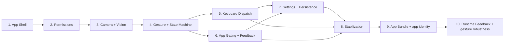

# VibeGesture Roadmap

## 1. 目的

这份 roadmap 用来把现有设计文档落实成可执行的实现顺序。

它面向后续 coder agent，回答三个问题：
- 先做什么
- 为什么必须按这个顺序做
- 每一阶段完成后要达到什么状态

### 与其他文档的边界
- `PRD.md` 定义产品行为。
- `AGENTS.md` 定义实现原则和范围边界。
- `TECH_ARCHITECTURE.md` 定义系统结构。
- `TECH_IMPLEMENTATION_PLAN.md` 定义执行级实现细节。
- 本文档只负责阶段顺序、依赖关系和退出条件。

---

## 2. 当前状态

当前仓库已经完成：
- 产品需求定义
- 贡献者约束定义
- 技术架构定义
- 技术详细方案定义
- 阶段 1：App Shell 与配置骨架
- 阶段 2：权限与安全关停
- 阶段 3：摄像头采集与 Vision pipeline
- 阶段 4：手势解释与 state machine
- 阶段 5：键盘事件发射与安全时序
- 阶段 6：前台应用 gating 与反馈
- 阶段 7：设置界面与配置持久化
- 阶段 8：稳定化、调优与端到端验证

当前实现已经从纯设计阶段进入实现阶段，并且已经完成到阶段 8。  
此外，当前还存在一个新的后续阶段 9：把 SwiftPM executable 壳层收束成真正的 macOS app bundle / app identity，以便权限能正确归属到 VibeGesture 自身。  
因此 roadmap 的目标是把“已完成的前置能力”继续串成后续可执行阶段，而不是重新从 shell、权限、手势解释、键盘发射、前台应用 gating 或稳定化收尾开始。

2026-04-15 这一阶段已完成最小 app bundle 包装与 app icon 落地，后续任务应围绕 bundle 启动验证与权限复验进行 reviewer 级验收。
2026-04-15 继续新增后续阶段 10：runtime feedback 与 gesture robustness，聚焦菜单栏实时刷新、gesture 展示、cancel 时序和 record / submit 误触率。
2026-04-16 在阶段 10 之后新增后续阶段 11：gesture classifier 与个性化校准，聚焦把 `record` / `submit` 从硬阈值改成基于手部关键点的轻量训练分类器；下一张 task 卡先补用户侧校准入口与采样闭环，随后继续把 `cancel` 样本和前台校准例外补齐。
2026-04-18 阶段 11 的下一轮优化聚焦在当前训练模式本身：先让用户样本优先主导 classifier，再用 bootstrap 作为 cold-start fallback，暂不回退到规则模式。
2026-04-18 阶段 11 的后续跟进开始聚焦 `record` 召回率：当前验收显示 `record` 仍容易回退为 `background`，下一张 task 卡应先对齐 calibrated runtime 与训练口径，再视需要补更直接的 `record` 几何特征。
2026-04-18 在进一步验收后，阶段 11 现已转向直接的 runtime 规则模式重构：训练 classifier 的在线识别效果与复杂度都不再满足当前目标，下一张 task 卡应把 `GestureInterpreter` 直接切回规则判定，同时保留 state machine / keyboard / gate 这条后半链路。

---

## 3. 规划原则

1. 先打通最小闭环，再做增强
2. 先保证状态机正确，再做 UI 细节
3. 先保证权限、安全和 gating，再做体验调优
4. 先做单一推荐实现，不提前分叉方案
5. 每一阶段都要有明确退出条件

---

## 4. 阶段总览

建议的实现顺序如下：

1. App Shell 与配置骨架
2. 权限与安全关停
3. 摄像头采集与 Vision pipeline
4. 手势解释与 state machine
5. 键盘事件发射与安全时序
6. 前台应用 gating 与反馈
7. 设置界面与配置持久化
8. 稳定化、调优与端到端验证

这八个阶段之间应尽量保持单向依赖，不要过早把后面的能力提前混进前面的任务里。

---

## 5. 阶段 1：App Shell 与配置骨架

### 目标
先把应用跑起来，并拥有最基本的菜单栏交互、配置入口和状态容器。

### 主要内容
- App 入口
- 菜单栏图标
- 识别开 / 关切换
- 全局快捷键的接线
- 配置存储的基本形态
- 简单设置入口壳层

### 依赖
- 无前置实现依赖
- 只依赖已确认的产品决策

### 退出条件
- 应用可以以 macOS 菜单栏工具形式启动
- 用户可以看到识别开 / 关入口
- 用户可以通过菜单栏或全局快捷键切换识别状态
- 配置对象的结构已经能承载后续的快捷键和状态持久化

### 风险提示
- 不要在这一阶段引入摄像头或手势逻辑
- 不要把 UI 做成完整偏好设置产品

---

## 6. 阶段 2：权限与安全关停

### 目标
把 Camera 和 Accessibility 的权限检查、首次启动引导、缺失权限状态和安全停录行为先做稳。

### 主要内容
- Camera 权限检查
- Accessibility trust 检查
- 首次启动权限引导
- 缺失权限错误状态
- 权限丢失时的安全停录
- 识别关闭 / 超时关停时的安全停录

### 依赖
- 依赖阶段 1 的 app shell 和状态容器

### 退出条件
- 应用可以准确知道自己缺少哪一种权限
- 首次启动能只提示缺失的那个权限
- 如果录音开启时权限丢失，系统会先停止录音，再进入错误状态
- 如果识别被手动关闭或自动超时，系统会先停止录音，再真正关闭

### 风险提示
- 权限流不要和手势逻辑耦合
- 不要把权限状态和识别状态混成一个不可分的开关

---

## 7. 阶段 3：摄像头采集与 Vision pipeline

### 目标
先把默认摄像头帧流稳定送进 Vision hand pose detection。

### 主要内容
- `AVCaptureSession`
- 默认摄像头采集
- 帧分发队列
- Vision hand pose 请求
- 单手右手观测输出

### 依赖
- 依赖阶段 1 的 app shell
- 依赖阶段 2 的权限能力

### 退出条件
- 应用能稳定从默认摄像头拿到帧
- Vision pipeline 能持续输出标准化手部观测
- 识别开关关闭时，采集会停止

### 风险提示
- 不要在这一阶段解释手势
- 不要把状态机塞进 frame callback

---

## 8. 阶段 4：手势解释与 state machine

### 目标
把原始观测转成可执行的 gesture candidate，并用显式 state machine 管起来。

### 主要内容
- record 检测
- record re-arm / record exit 检测
- submit 检测
- cancel 检测
- 阈值和 debounce
- `disabled` / `idle` / `recording_active` / `cooldown` / `error_permission_missing`

### 依赖
- 依赖阶段 2 的权限状态
- 依赖阶段 3 的摄像头和 Vision pipeline

### 退出条件
- record 可以稳定触发一次
- 持续 record 不会重复触发
- submit 和 cancel 都是一次性触发
- cooldown 可以阻止重复触发
- `recording_active` 与 `idle` 之间的语义清晰

### 风险提示
- 这是整个项目最容易出错的阶段
- 不要把“解释手势”和“决定是否触发”混成一个函数
- 不要让 state machine 分散在多个 view model 里

---

## 9. 阶段 5：键盘事件发射与安全时序（已完成）

### 目标
把手势转成键盘动作，并保证录音切换、submit、cancel 的顺序正确。

### 主要内容
- 键盘事件发射器
- 单键 tap 发射
- record toggle 仅支持单键
- submit-while-recording-stop 的 300 ms 延迟
- cancel 抢占 submit 待处理动作
- 安全停录后的动作发射顺序

### 依赖
- 依赖阶段 4 的 gesture candidate 与 state machine
- 依赖阶段 2 的安全关停规则

### 退出条件
- record 能正确发出一次 record toggle tap
- submit 在录音关闭时发送 Enter
- submit 在录音开启时先停录、等待、再发送 Enter
- cancel 可以终止 submit 等待窗口
- 键盘发射逻辑集中在单一通道中

### 风险提示
- 不要在 UI 层直接发键盘事件
- 不要给 `Fn` 做特殊语义分支

---

## 10. 阶段 6：前台应用 gating 与反馈（已完成）

### 目标
把支持应用限制、菜单栏可视反馈和 overlay 反馈补齐。

### 主要内容
- 前台应用 bundle identifier 检测
- 支持应用白名单
- 不支持应用时忽略手势
- 录音开启时 app gate 丢失的安全停录
- 菜单栏状态视觉
- floating overlay 文案

### 依赖
- 依赖阶段 4 的 state machine
- 依赖阶段 5 的事件发射器

### 退出条件
- 只有 Codex、Claude Code、Cursor 前台时才会响应手势
- 非支持应用前台时手势被忽略
- 录音开启时切到不支持应用会先停录
- 菜单栏和 overlay 能清晰反映当前状态

### 风险提示
- 前台应用检测不能阻塞摄像头流水线
- 不要把白名单做成用户可编辑 UI

### 完成记录
- 已实现前台应用 bundle identifier 检测与固定白名单 gating
- 已实现前台应用不受支持时抑制手势和动作
- 已实现录音开启时 gate 丢失的安全停录
- 菜单栏和设置窗口已能显示当前 gate 状态

---

## 11. 阶段 7：设置界面与配置持久化（已完成）

### 目标
把最小设置面做完整，并让关键配置可以持久化。

### 主要内容
- 轻量 popover / 紧凑窗口
- global recognition shortcut
- record toggle shortcut
- submit shortcut
- cancel shortcut
- 配置持久化

### 依赖
- 依赖阶段 1 的配置骨架
- 依赖阶段 5 的事件发射器

### 退出条件
- 用户可以配置四类快捷键
- record toggle 仅允许单键
- 设置入口是轻量的，不会变成重型偏好设置窗口
- 配置能在重启后保留

### 风险提示
- 不要让设置页扩展成一个新的产品面
- 不要在设置里引入未决的产品能力

### 完成记录
- 已实现可编辑快捷键设置，覆盖 recognition toggle、record toggle、submit、cancel 四类配置
- 已实现 record toggle 的单键约束与运行时校验
- 已实现配置自动保存到 `config.json`
- 已实现启动后恢复最近一次保存的配置
- 已实现 recognition hotkey 变更后的运行时重绑

---

## 12. 阶段 8：稳定化、调优与端到端验证（已完成）

### 目标
把前面的基础能力连成可用闭环，并降低误触发与不稳定性。

### 主要内容
- 阈值微调
- cooldown 微调
- submit 延迟微调
- 权限边界验证
- app gating 验证
- 菜单栏与 overlay 体验打磨
- 端到端工作流测试

### 依赖
- 依赖前面所有阶段

### 退出条件
- 识别开 / 关稳定
- record 开始 / 停止录音稳定
- submit 稳定
- cancel 稳定
- 权限与 gating 的安全行为稳定
- 误触发率和延迟达到可用水平

### 风险提示
- 不要把调优理解成新功能开发
- 不要为了极限准确率破坏简单性

### 完成记录
- 已补强端到端验证，覆盖 recognition、keyboard dispatch、gating 与 settings persistence 的核心闭环
- 已补充稳定化 workflow tests，覆盖 gate 丢失、pending submit 收束、runtime hotkey rebind 与 record toggle 单键约束
- 已验证 `swift build`、`swift test` 和短启动检查通过

---

## 13. 阶段 9：App Bundle 与 app identity

### 目标
把当前 SwiftPM executable 壳层收束成真正的 macOS app bundle，使 Camera / Accessibility 权限和系统设置都绑定到 VibeGesture 自身，而不是 Terminal。

### 主要内容
- 最小 macOS app bundle wrapper
- 稳定的 bundle identifier
- Info.plist / app identity
- 本地 launch path 从 raw executable 切换到 bundle
- 权限读取、请求和系统设置入口在 bundle 身份下复验

### 依赖
- 依赖阶段 1 到阶段 8 的现有应用逻辑

### 退出条件
- 应用可以作为独立 `.app` bundle 启动
- System Settings 里 Camera / Accessibility 的授权目标显示为 VibeGesture，而不是 Terminal
- `PermissionManager.refresh()` 在给 bundle 授权后能读回正确状态
- 现有菜单栏、摄像头、gesture、keyboard 和 gate 行为不回退

### 风险提示
- 不要改手势语义、键盘时序或 gate 规则
- 不要顺手扩大到正式签名 / 公证 / 分发流水线，除非这是实现 bundle identity 所必需的最小步骤

---

## 14. 阶段 10：Runtime Feedback 与 gesture robustness

### 目标
把菜单栏状态刷新、姿态展示、cancel 时序和 record / submit 误触率收紧到更适合真实验收的水平。

### 主要内容
- 菜单栏状态实时刷新
- gesture / action 展示拆分与文案可读性
- cancel 时序以 Esc 为优先，避免录音路径扰动
- record / submit 的几何判定与阈值微调
- 针对误触与时序的回归测试补强

### 依赖
- 依赖阶段 4 的 gesture 解释
- 依赖阶段 5 的键盘发射与安全时序
- 依赖阶段 8 的稳定化验证基础
- 建议在阶段 9 的 bundle 启动路径上继续验收

### 退出条件
- 菜单栏状态在打开期间能跟随最新 AppState 更新
- gesture 展示能清楚区分当前候选、当前姿态和最近动作
- cancel 在录音路径里优先把 Esc 送出去，不依赖外部录音状态回读
- record / submit 的误触率明显下降
- 有对应回归测试覆盖这些边界

### 风险提示
- 不要引入外部录音状态探测
- 不要把展示层和动作层重新耦合
- 不要顺手增加新手势或新设置项

---

## 15. 阶段间依赖图

---

## 16. 完成判定

当且仅当以下条件全部满足时，V1 roadmap 才算走完：

1. 应用能在 macOS 菜单栏中运行
2. 识别开 / 关可控
3. 权限流正确
4. 摄像头与 Vision pipeline 正常
5. record 能切换录音
6. submit 能发送 Enter
7. cancel 能中止流程
8. 支持应用 gating 正确
9. overlay 与菜单栏反馈清晰
10. 配置可持久化
11. 端到端流程能在支持应用里稳定使用
12. 应用以独立 macOS app bundle 形式运行，权限和系统设置绑定到 VibeGesture 自身而不是 Terminal
13. 菜单栏反馈和手势误触稳定性达到可接受水平

---

## 17. 给后续 coder agent 的提示

后续任务应该严格按照阶段顺序推进。

如果某一阶段的实际结果和预期不同，下一阶段必须基于“实际结果”重排，而不是假设前一阶段已经完美完成。

不要跳过阶段。  
不要合并不相干阶段。  
不要为了赶进度提前引入后续阶段的复杂性。
