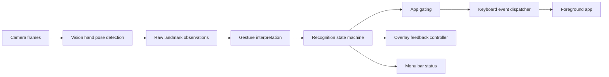

# VibeGesture 技术架构

## 1. 文档目的

本文件定义 VibeGesture 的推荐系统架构。

它面向后续的 coder agent，作为实现工作的结构参考。它的层级刻意比详细技术方案更高，不应重复 `PRD.md` 或 `AGENTS.md` 中的每一条行为规则。

### 文档边界
- `PRD.md` 定义产品需求和产品行为。
- `AGENTS.md` 定义贡献者约束和实现原则。
- 本文件定义系统形态：模块划分、运行边界、数据流和集成点。
- `TECH_IMPLEMENTATION_PLAN.md` 定义该架构之内的操作级细节和执行行为。

如果本文件与 PRD 或 AGENTS 出现冲突，应以 PRD / AGENTS 为准。

---

## 2. 架构目标

本架构应优化以下目标：
- 可预测的手势行为
- 低延迟的 camera-to-action 流程
- 小体量的原生 macOS 占用
- 显式的状态转移
- 安全的键盘事件发射
- 方便后续 coder agent 理解

本架构应避免：
- 隐式自动化
- 过度通用的插件系统
- 分布式子系统
- 投机性的 ML pipeline
- 不必要的 UI 复杂度

---

## 3. 推荐技术栈

V1 的单一推荐实现是：
- Swift
- SwiftUI 用于轻量 UI
- 需要菜单栏或系统集成时使用 AppKit
- AVFoundation 用于摄像头采集
- Vision 用于手部姿态检测
- Quartz Event Services / `CGEvent` 用于键盘事件发射
- Accessibility APIs 用于信任 / 权限检查

### 为什么选这套栈
- 它是 macOS 原生技术。
- 它能把摄像头、UI 和输入合成放在同一个生态里。
- 它能把依赖风险降到最低。
- 它非常适合 V1 这种小而固定的手势集合。

### 少量可替代点
如果未来迭代需要更复杂的并发隔离，可以把 state machine 迁移到更强的 actor 模型。但 V1 不推荐从这里起步。

---

## 4. 系统总览

VibeGesture 是一个本地 macOS 菜单栏应用，由少量协作模块组成：

1. 菜单栏壳层（menu bar shell）
2. 权限管理器
3. 识别会话管理器
4. 摄像头采集流水线
5. 手部姿态检测层
6. 手势解释层
7. 识别 state machine
8. 支持应用 gate
9. 键盘事件发射器
10. overlay 反馈控制器
11. 设置界面

系统行为可理解为一条流水线：

### 架构原则
原始检测结果不应直接发出键盘事件。  
所有用户可见动作都必须先经过 state machine 和支持应用 gate。

---

## 5. 运行边界

### 5.1 主线程
主线程应负责：
- SwiftUI 视图
- 菜单栏展示
- 设置 popover / window 展示
- 权限提示和用户可见状态更新

### 5.2 采集与 Vision 处理
一个独立的采集 / 处理队列应负责：
- `AVCaptureSession`
- 帧投递
- Vision hand pose 请求
- 每帧手势特征提取

### 5.3 状态与事件协调
一个单线程的协调层应负责：
- 手势解释结果
- 状态转移
- cooldown 计时
- submit / cancel 的时序控制
- 键盘事件发射顺序

它可以实现为一个专门的 coordinator 对象，配合串行队列；也可以实现为一个小型 actor 子系统。V1 的推荐选择是串行 coordinator，因为它更容易理解，也更容易排查问题。

### 5.4 安全规则
任何 UI 代码都不应直接发射键盘事件。

---

## 6. 核心模块

### 6.1 菜单栏壳层
职责：
- app 生命周期
- 菜单栏图标
- 识别开 / 关入口
- 设置入口
- 退出入口

非职责：
- 摄像头逻辑
- 手势逻辑
- app gating 逻辑

### 6.2 权限管理器
职责：
- Camera 权限状态
- Accessibility 信任状态
- 首次启动权限引导
- 当权限丢失时协调安全停录状态

非职责：
- 手势解释
- 键盘事件发射

### 6.3 识别会话管理器
职责：
- 开始和停止识别会话
- 开始 / 停止摄像头采集
- 维护 active-recognition 的计时
- 协调识别被关闭、超时或失效时的关停

非职责：
- 分类手势
- 决定 app 是否受支持

### 6.4 摄像头采集流水线
职责：
- 从默认摄像头获取帧
- 为 Vision 规范化帧投递
- 保持较低采集延迟

非职责：
- 状态转移
- 已发出的动作

### 6.5 手部姿态检测层
职责：
- 调用 Vision hand pose APIs
- 生成标准化的单手手部观测
- 为 gesture interpreter 提供足以识别 pinch、submit、cancel 和 re-arm 条件的信号

非职责：
- 手势语义
- 键盘事件

### 6.6 手势解释层
职责：
- 将原始手部姿态观测转成已解释的 gesture candidate
- 应用阈值和 debounce 规则
- 判断 pinch / submit / cancel / re-arm 条件何时成立

非职责：
- 决定当前前台应用是否被允许
- 发射键盘事件

### 6.7 识别 state machine
职责：
- 拥有当前识别状态
- 决定某个已解释手势是否应该触发动作
- 强制执行 cooldown 和 re-arm 行为
- 协调录音开启 / 关闭语义

非职责：
- 摄像头采集
- Vision 检测细节

### 6.8 支持应用 gate
职责：
- 判断当前前台应用是否受支持
- 在前台应用不受支持时阻止手势动作
- 当 gate 失效且录音仍处于开启状态时，确保安全停止录音

非职责：
- 手势分类
- UI 布局

### 6.9 键盘事件发射器
职责：
- 向系统发送单键 tap 或键盘事件
- 保持事件顺序
- 在发射前集中执行安全检查

非职责：
- 决定哪个手势应该触发

### 6.10 Overlay 反馈控制器
职责：
- 展示简短反馈消息
- 保持反馈轻量且不打扰
- 回显关键状态变化

非职责：
- 核心行为决策

### 6.11 设置界面
职责：
- 暴露 V1 的最小配置面
- 以轻量 popover 或紧凑 window 的方式呈现
- 让配置可发现，但不变成完整偏好设置产品

非职责：
- 复杂工作流
- 产品扩展

---

## 7. 数据流

推荐的数据流如下：

1. camera frame 到达
2. Vision 产出手部姿态数据
3. gesture interpreter 更新候选手势状态
4. state machine 根据当前识别状态评估当前手势
5. 支持应用 gate 验证前台应用
6. 如果允许，则 event dispatcher 发射键盘输入
7. overlay controller 和菜单栏壳层渲染反馈

### 重要约束
系统不应允许原始手势检测绕过 state machine。

---

## 8. 前台应用 gating

V1 应使用 bundle identifier 匹配前台应用。

推荐的 bundle identifier：
- Codex: `com.openai.codex`
- Claude Code: `com.anthropic.claudefordesktop`
- Cursor: `com.todesktop.230313mzl4w4u92`

### 架构建议
- 在代码中把白名单做成数据驱动
- 匹配逻辑保持小而显式
- V1 不暴露白名单编辑

### 安全规则
如果前台应用在录音开启期间变成不受支持，系统必须先停止录音，再抑制后续动作。

---

## 9. 状态机形状

推荐的内部状态：
- `disabled`
- `idle`
- `recording_active`
- `cooldown`
- `error_permission_missing`

### 状态职责
- `disabled`：识别关闭
- `idle`：识别开启但录音未开启
- `recording_active`：目标应用当前已经处于录音开启状态
- `cooldown`：一次性动作后的短暂 refractory 状态
- `error_permission_missing`：必需权限缺失或被撤销

### 架构规则
state machine 应当是唯一决定“某个检测到的手势是否可执行”的地方。

---

## 10. 事件语义（架构层）

本架构假设 V1 的行为模型是 toggle：
- pinch 通过单键 tap 切换录音开启 / 关闭
- submit 在处理完录音状态后发送文本
- cancel 中断当前流程，必要时先安全停止录音

本架构不定义每一个精确时序阈值，这些细节属于详细技术方案。

---

## 11. UI 架构

### 11.1 菜单栏优先
应用应以菜单栏图标和轻量状态交互为中心。

### 11.2 设置入口
推荐的呈现方式是：
- 一个 popover 风格的轻量入口
- 仅在实现需要时才使用一个紧凑窗口

### 11.3 Overlay
overlay 反馈应是辅助层，而不是主要导航层。

### 11.4 视觉优先级
菜单栏图标和 overlay 应该传达：
- 识别开 / 关
- 录音开启 / 关闭
- 权限缺失
- 动作已触发

---

## 12. 错误与关停模型

架构应区分以下几种情况：
- 正常状态转移
- 权限丢失导致的关停
- app gating 失效导致的关停
- 用户手动禁用

### 安全关停规则
如果录音处于开启状态，而系统因为超时、权限丢失或 app gating 失效而即将禁用识别，应先发出单次停录动作，再转入 blocked 或 disabled 状态。

### 事件安全规则
键盘事件发射应集中在一个地方，这样安全检查才容易审计。

---

## 13. 建议的文件级拆分

这不是强制实现要求，但这是推荐的文件组织方向：

- `App` 和菜单栏连接
- 权限管理器
- 摄像头 / Vision 流水线
- 手势解释器
- 识别 state machine
- app gate 检查器
- 键盘事件发射器
- overlay 控制器
- 设置视图 / view model

这样做的目标，是把代码库控制在一个足够小的范围内，后续 agent 不需要跨文件猜测就能理解整条流程。

---

## 14. 本文件不决定的内容

本文件有意不完全规定：
- 精确的帧阈值
- 精确的 debounce 数值
- 详细的 submit / cancel 时序
- 详细的 UI 文案
- 具体的 Swift 类型名
- 具体的文件名

这些细节属于 `TECH_IMPLEMENTATION_PLAN.md`。

---

## 15. 架构总结

推荐架构是一条小型原生 macOS 流水线：

`camera -> Vision -> gesture interpreter -> state machine -> app gate -> keyboard dispatcher -> feedback`

核心设计规则很简单：
- 先做原始手部姿态检测
- 再集中解释手势
- 再集中决定状态转移
- 最后才发射键盘动作
